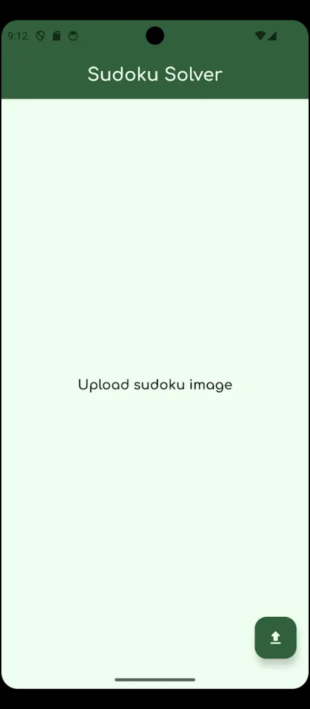
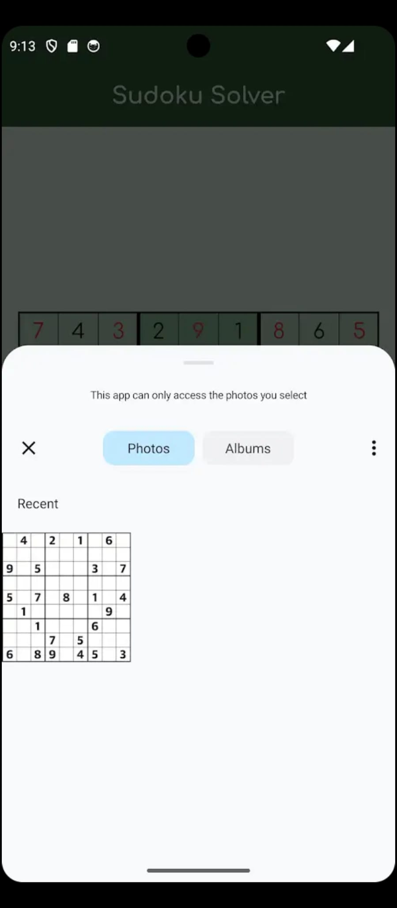
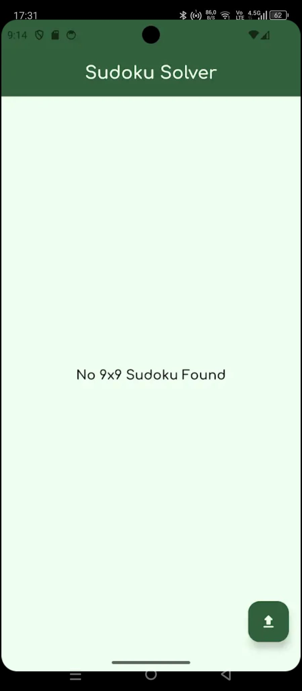
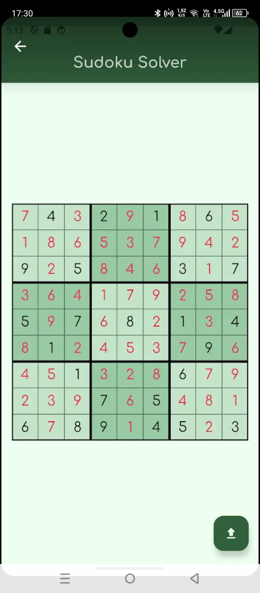

# 🧩 Sudoku Solver from Image

Google Play Store linki : https://play.google.com/store/apps/details?id=com.mehmetaliozek.sudokusolver

This project is a complete solution pipeline that takes an image of a Sudoku puzzle, extracts the digits using computer vision, and solves the puzzle using a backtracking algorithm. Built using Python, OpenCV, Tensorflow,NumPy and Flask.

## 📌 Features

- ✅ Detects Sudoku grid from any image
- ✅ Digit recognition with Tesseract OCR
- ✅ Handles incomplete or noisy grids
- ✅ Solves the puzzle using backtracking
- ✅ Visualizes the solved puzzle on the original image

## 📷 Example

**Upload Image:**

** Wrong Input :** 

**Solved Output:**

## 🛠️ Technologies

- Python 3.x  
- OpenCV  
- Tensorflow
- NumPy  
- Matplotlib (optional, for visualization)
